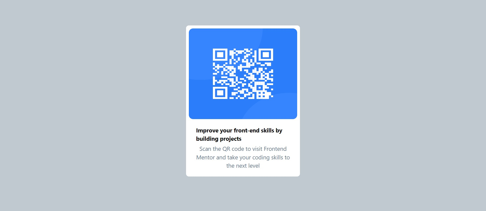

# Frontend Mentor - Qr-Code-component solution

This is a solution to the [Qr-code-component challenge on Frontend Mentor](https://www.frontendmentor.io/challenges/qr-code-component-iux_sIO_H). Frontend Mentor challenges help you improve your coding skills by building realistic projects. 

## Table of contents

- [Overview](#overview)
  - [The challenge](#the-challenge)
  - [Screenshot](#screenshot)
  - [Links](#links)
- [My process](#my-process)
  - [Built with](#built-with)
  - [What I learned](#what-i-learned)
  - [Continued development](#continued-development)
  - [Useful resources](#useful-resources)
- [Author](#author)
- [Acknowledgments](#acknowledgments)


## Overview

### The challenge

Create a responsive card layout for the mobile and desktop design.

### Screenshot




### Links

- Solution URL: [Add solution URL here](https://your-solution-url.com)
- Live Site URL: [View my live Site](https://matt-qr-code-component.vercel.app/)

## My process

### Built with

- Semantic HTML5 markup
- CSS custom properties
- Flexbox
- Mobile-first workflow
- [React](https://reactjs.org/) - JS library
-[TailwindCSS](https://tailwindcss.com/) - Mobile first class based CSS for Styling


### What I learned

I have learnt how to build in React using component first approach.I have also learnt how use Tailwind CSS to style my components.

To see how you can add code snippets, see below:

```
Component-first approach
<div className=" p-2 bg-white rounded-lg h-[500px] md:h-[400px] md:w-[300px] flex flex-col items-center">
            
            <div className="text-left p-5">
                <h1 className="font-bold">Improve your front-end skills by building projects</h1>
                <p className="text-slate-500 font-normal text-center py-1">Scan the QR code to visit Frontend Mentor and take your coding skills to the next level</p>
            </div>
        </div>
```

### Continued development
I have had a challenge getting the actual image and card size from the mobile and desktop designs


### Useful resources

- [Tailwind CSS](https://tailwindcss.com/docs/guides/vite) - This helped me to set up the card component and the tailwind styles.


## Author

- Website - [My portifolio](https://www.matthewkuria.vercel.app)
- Frontend Mentor - [@matthewkuria](https://www.frontendmentor.io/profile/matthewkuria)
- Twitter - [@matthew-kuria](https://www.twitter.com/matthew-kuria)


## Acknowledgments

I would like to acknowledge Frontendmentor for coming up with  this challenge project and tailwind CSS for the their straightforward vite Framework guide.
